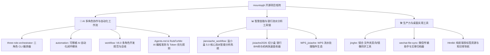

# 🚀 Mountopjh (山顶见) 的开源工作台

**多角色 AI 协作开发框架 · 银行流水金融数据工具箱 · 个人生产力效率工具**

---

> 💡 **核心理念**：结合第一性原理与卡帕西方法论，打造“想清楚 → 写出来 → 验对了”的 AI 自动化开发闭环与高效金融数据处理工具。

---

## 🧭 项目全景导航 (Repository Matrix)

---

## 🤖 1. AI 自动化与多角色协同开发 (Multi-Agent & Workflow)

> 解决大模型幻觉与单点上下文限制，实现「规划师（任务拆解）→ 执行者（严谨编码）→ 审计员（回归验收）」全自动化闭环。

| 仓库名称 | 定位与核心功能 | 核心语言 / 技术 | 推荐场景 |
| :--- | :--- | :--- | :--- |
| [**three-role-orchestrator**](https://github.com/mountopjh/three-role-orchestrator) | **三角色自动化编排 CLI**：支持 Kiro、Codex、CodeBuddy、Claude Opus/Sonnet、GLM 等多模型调度，具备状态机与失败自愈。 | `PowerShell` / CLI | 独立启动多模型协作开发大型复杂工程 |
| [**automation**](https://github.com/mountopjh/automation) | **可移植 AI 自动化内核**：复制到任何项目根目录即可直接使用，内置 Watchdog 看门狗与 IDE Hook 闭环。 | `PowerShell` / Scripts | 快速植入已有项目，提升日常写代码自动化度 |
| [**workflow**](https://github.com/mountopjh/workflow) | **通用 AI 协作开发规范 V6.0**：文件驱动通信、`.tmp` 原子重命名、抗提示注入、3次驳回熔断机制。 | `Python` / Batch / Docs | 团队多角色 AI 研发标准 SOP 与初始化脚手架 |
| [**RulsForMe**](https://github.com/mountopjh/RulsForMe) | **AI 辅助开发分层规则方法论**：按需分层加载规则，极致节省 Token，严格约束 AI 编码行为。 | `Markdown` / Rules | 适用于 Cursor / Kiro / Claude Code 的全局规则设定 |
| [**Agents.md**](https://github.com/mountopjh/Agents.md) | **Karpathy + 第一性原理 Agent 规则规范**：从底层业务目标推导实现的顶层思维原则。 | `Markdown` / Prompts | 作为通用项目根目录下的 `AGENTS.md` 基础模版 |

---

## 📊 2. 智慧金融与银行流水分析 (FinTech & Bank Statement Toolkit)

> 专为银行业务流水清洗、交易分类、对公/对私分析、BIN 码快速识别打造的专业工具箱。

| 仓库名称 | 定位与核心功能 | 核心语言 / 部署 | 快速上手 |
| :--- | :--- | :--- | :--- |
| [**jianxiaohe_workflow**](https://github.com/mountopjh/jianxiaohe_workflow) | **监小盒 5.0 (JianXiaoHe)**：企业级银行流水清洗、分类、抽丝剥茧与全自动报告生成系统。 | `Python` / `HTML` / `Bat` | 内置 `build.bat` 一键构建，支持个人与对公规则模版 |
| [**jixiaohe2026**](https://github.com/mountopjh/jixiaohe2026) | **纪小盒 BIN 码查询器**：支持桌面悬浮窗全局快捷键、离线卡号识别、Bmob 云端同步与自动升级。 | `Python` (GUI) / `EXE` | 提供免安装 EXE，双击 `启动程序.bat` 极速运行 |
| [**WPS_jixiaohe**](https://github.com/mountopjh/WPS_jixiaohe) | **WPS 银行流水插件**：将流水清洗与统计能力无缝内嵌至 WPS 表格。 *(规划中)* | `JavaScript` / WPS Addon | 即装即用 Office 办公自动化扩展 |

---

## 🛠️ 3. 生产力工具与资产门户 (Productivity & Web Tools)

| 仓库名称 | 定位与核心功能 | 技术栈 | 特性亮点 |
| :--- | :--- | :--- | :--- |
| [**jinghe (镜合)**](https://github.com/mountopjh/jinghe) | **文件夹同步与镜像工具**：双向增量同步、哈希去重比对、支持多策略配置。 | `Python` / `PyInstaller` | 支持一键生成 Windows 独立 EXE，带可视化日志 |
| [**Htmlbl**](https://github.com/mountopjh/Htmlbl) | **纯前端资源导航与知识库门户**：基于 Excel 维护数据，支持拼音模糊检索与玻璃拟物美学 UI。 | `HTML5` / `Vanilla JS` / `SheetJS` | 零后端成本，直接托管至 GitHub Pages 即可对外服务 |
| [**wechat-file-sync**](https://github.com/mountopjh/wechat-file-sync) | **微信文件与公众号文章归档器**：自动归类下载传输助手文件与公众号优质内容。 | `Python` / Automation | 本地数据隐私安全，支持全文检索与分门别类 |

---

## 📌 推荐置顶项目 (Pinned Repositories Recommendation)

建议在 GitHub Profile 中 Pin 以下 6 个代表性仓库：
1. ⭐ **`three-role-orchestrator`** — *展示强大的多 Agent 编排技术能力*
2. ⭐ **`jianxiaohe_workflow`** — *展示行业级金融数据流垂直应用深度*
3. ⭐ **`jixiaohe2026`** — *展示开箱即用的桌面工具体验与活跃度*
4. ⭐ **`jinghe`** — *展示实用型桌面工具工程化能力*
5. ⭐ **`workflow`** — *展示规范化的 AI 开发方法论*
6. ⭐ **`Htmlbl`** — *展示前端交互与轻量化知识门户设计*

---

  Made with ❤️ by <a href="https://github.com/mountopjh">mountopjh</a> · 持续迭代，重构生产力边界

