# 🚀 Mountopjh (山顶见) 的开源工作台

**多角色 AI 协作开发框架 · 银行流水金融数据工具箱 · 个人生产力效率工具**

---

> 💡 **核心理念**：结合第一性原理与卡帕西方法论，打造“想清楚 → 写出来 → 验对了”的 AI 自动化开发闭环与高效金融数据处理工具。

---

## 🧭 项目全景导航 (Repository Matrix)

```mermaid
graph TD
    Root[mountopjh 开源项目矩阵]
    
    Root --> A[🤖 AI 多角色协作与自动化工作流]
    Root --> B[🧠 AI 规则与提示词工程]
    Root --> C[📊 智慧金融与银行流水分析工具链]
    Root --> D[🛠️ 生产力与桌面 / Web 工具]
    Root --> E[📈 专项业务与量化策略]

    A --> A1[ai-project-bootstrap: 通用 AI 项目启动与上下文治理器]
    A --> A2[ai-dev-orchestrator / three-role-orchestrator: 三角色 CLI 编排系统]
    A --> A3[kiro-chat-archiver: Kiro / AI 对话自动归档工具]
    A --> A4[automation: 可移植 AI 自动化闭环内核]
    A --> A5[workflow / human_workflow: 开发规范与脚手架]

    B --> B1[Agents.md: Karpathy + 第一性原理 Agent 规则]
    B --> B2[RulsForMe: AI 分层规则与 Token 优化方法论]

    C --> C1[jianxiaohe_workflow: 监小盒 5.0 核心流水分析系统]
    C --> C2[jixiaohe2026: 纪小盒 银行 BIN 码查询器]
    C --> C3[WPS_jixiaohe & CPBank-2026: WPS 插件与专项模块]

    D --> D1[jinghe: 镜合 文件夹双向/镜像同步工具]
    D --> D2[wechat-file-sync: 微信传输助手与文章归档器]
    D --> D3[Htmlbl: 纯前端多标签资源与知识库导航]

    E --> E1[Kiro_kezhuanzhai: 可转债量化分析与交易辅助策略]
```

---

## 🤖 1. AI 自动化与多角色协同开发 (Multi-Agent & Workflow)

> 解决大模型幻觉与单点上下文限制，实现「规划师（任务拆解）→ 执行者（严谨编码）→ 审计员（回归验收）」全自动化闭环。

| 仓库名称 | 定位与核心功能 | 核心语言 / 技术 | 推荐场景 |
| :--- | :--- | :--- | :--- |
| [**ai-project-bootstrap**](https://github.com/mountopjh/ai-project-bootstrap) | **通用 AI 项目启动器**：零 Token 消耗、三层分层上下文地图 (PROJECT_INDEX, DEVELOPMENT_MAP, CODE_MAP) 与本地对话自动归档脚手架。 | `PowerShell` / `Python` | 任意新项目一键搭建 AI Agent 上下文治理与规范 |
| [**ai-dev-orchestrator**](https://github.com/mountopjh/ai-dev-orchestrator) | **三角色 AI 自动化开发编排系统**：Planner-Executor-Auditor 闭环、自动故障恢复与 Watchdog 监控。 | `PowerShell` / CLI | 独立启动多 AI 模型协作开发复杂工程 |
| [**three-role-orchestrator**](https://github.com/mountopjh/three-role-orchestrator) | **三角色自动化编排 CLI**：支持 Kiro、Codex、Claude Opus/Sonnet、GLM 等多模型调度，具备状态机自愈。 | `PowerShell` / CLI | 多模型/多终端 CLI 自动化调度 |
| [**kiro-chat-archiver**](https://github.com/mountopjh/kiro-chat-archiver) | **Kiro / AI 对话历史自动归档工具**：零 Token 消耗、防 Hook 阻塞静默退出、时间戳双地图标自动沉淀。 | `PowerShell` / Kiro Hook | Kiro IDE 对话历史极速沉淀与归档 |
| [**automation**](https://github.com/mountopjh/automation) | **可移植 AI 自动化内核**：复制到任何项目根目录即可直接使用，内置 Watchdog 看门狗与 IDE Hook 闭环。 | `PowerShell` / Scripts | 快速植入已有项目提升写代码自动化 |
| [**workflow**](https://github.com/mountopjh/workflow) | **通用 AI 协作开发规范 V6.0**：文件驱动通信、`.tmp` 原子重命名、抗提示注入、3次驳回熔断机制。 | `Python` / Batch / Docs | 团队多角色 AI 研发标准 SOP 与脚手架 |
| [**human_workflow**](https://github.com/mountopjh/human_workflow) | **人机协同开发工作流历史归档**：演进历史配置与 Kiro 早期规范参考归档。 | `Markdown` / Archive | 规理演进参考 |

---

## 🧠 2. AI 规则与提示词工程 (AI Rules & Prompt Engineering)

> 极致压缩上下文，统一 AI 行为约束，消除幻觉与“越改越乱”问题。

| 仓库名称 | 定位与核心功能 | 技术栈 | 推荐场景 |
| :--- | :--- | :--- | :--- |
| [**Agents.md**](https://github.com/mountopjh/Agents.md) | **Karpathy + 第一性原理 Agent 规则模版**：从底层业务目标推导实现的顶层思维原则。 | `Markdown` / Prompts | 作为通用项目根目录下的 `AGENTS.md` 基础模版 |
| [**RulsForMe**](https://github.com/mountopjh/RulsForMe) | **AI 辅助开发分层规则方法论**：按需分层加载规则，极致节省 Token，严格约束 AI 编码行为。 | `Markdown` / Rules | Cursor / Kiro / Claude Code 的全局规则配置 |

---

## 📊 3. 智慧金融与银行流水分析 (FinTech & Bank Statement Toolkit)

> 专为银行业务流水清洗、交易分类、对公/对私分析、BIN 码快速识别打造的专业工具箱。

| 仓库名称 | 定位与核心功能 | 核心语言 / 部署 | 快速上手 |
| :--- | :--- | :--- | :--- |
| [**jianxiaohe_workflow**](https://github.com/mountopjh/jianxiaohe_workflow) | **监小盒 5.0 (JianXiaoHe)**：企业级银行流水清洗、分类、抽丝剥茧与全自动报告生成系统。 | `Python` / `HTML` / `Bat` | 内置 `build.bat` 一键构建，支持个人与对公规则模版 |
| [**jixiaohe2026**](https://github.com/mountopjh/jixiaohe2026) | **纪小盒 BIN 码查询器**：支持桌面悬浮窗全局快捷键、离线卡号识别、Bmob 云端同步与自动升级。 | `Python` (GUI) / `EXE` | 提供免安装 EXE，双击 `启动程序.bat` 极速运行 |
| [**WPS_jixiaohe**](https://github.com/mountopjh/WPS_jixiaohe) | **WPS 银行流水插件**：将流水清洗与统计能力无缝内嵌至 WPS 表格。 | `JavaScript` / WPS Addon | 即装即用 Office 办公自动化扩展 |
| [**CPBank-2026**](https://github.com/mountopjh/CPBank-2026) | **央地银行流水专项清理引擎**：监小盒专项清理与分类模块。 | `Python` / Fintech | 专项银行流水分类扩展 |

---

## 🛠️ 4. 生产力工具与资产门户 (Productivity & Web Tools)

| 仓库名称 | 定位与核心功能 | 技术栈 | 特性亮点 |
| :--- | :--- | :--- | :--- |
| [**jinghe (镜合)**](https://github.com/mountopjh/jinghe) | **文件夹同步与镜像工具**：双向增量同步、哈希去重比对、支持多策略配置。 | `Python` / `PyInstaller` | 支持一键生成 Windows 独立 EXE，带可视化日志 |
| [**Htmlbl**](https://github.com/mountopjh/Htmlbl) | **纯前端资源导航与知识库门户**：基于 Excel 维护数据，支持拼音模糊检索与玻璃拟物美学 UI。 | `HTML5` / `Vanilla JS` / `SheetJS` | 零后端成本，直接托管至 GitHub Pages 即可对外服务 |
| [**wechat-file-sync**](https://github.com/mountopjh/wechat-file-sync) | **微信文件与公众号文章归档器**：自动归类下载传输助手文件与公众号优质内容。 | `Python` / Automation | 本地数据隐私安全，支持全文检索与分门别类 |

---

## 📈 5. 专项业务与量化策略 (Quant & Specialized Strategy)

| 仓库名称 | 定位与核心功能 | 技术栈 | 推荐场景 |
| :--- | :--- | :--- | :--- |
| [**Kiro_kezhuanzhai**](https://github.com/mountopjh/Kiro_kezhuanzhai) | **可转债量化策略库**：基于 Kiro 工作流的可转债量化分析与交易辅助策略库。 | `Python` / Finance | 可转债量化数据挖掘与策略迭代 |

---

## 📌 推荐置顶项目 (Pinned Repositories Recommendation)

建议在 GitHub Profile 中 Pin 以下 6 个代表性仓库：
1. ⭐ **`ai-project-bootstrap`** — *通用 AI 项目启动与上下文治理工具*
2. ⭐ **`three-role-orchestrator`** — *展示强大的多 Agent 编排技术能力*
3. ⭐ **`jianxiaohe_workflow`** — *展示行业级金融数据流垂直应用深度*
4. ⭐ **`jixiaohe2026`** — *展示开箱即用的桌面工具体验与活跃度*
5. ⭐ **`jinghe`** — *展示实用型桌面工具工程化能力*
6. ⭐ **`Htmlbl`** — *展示前端交互与轻量化知识门户设计*

---

  Made with ❤️ by <a href="https://github.com/mountopjh">mountopjh</a> · 持续迭代，重构生产力边界

